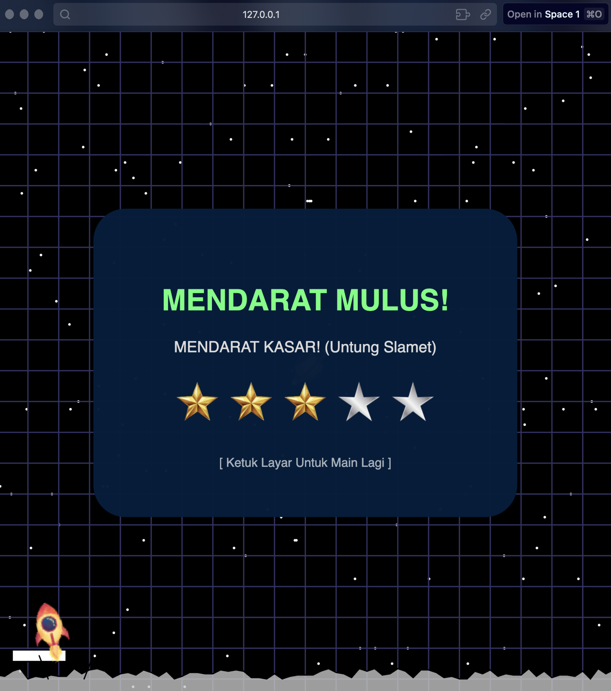
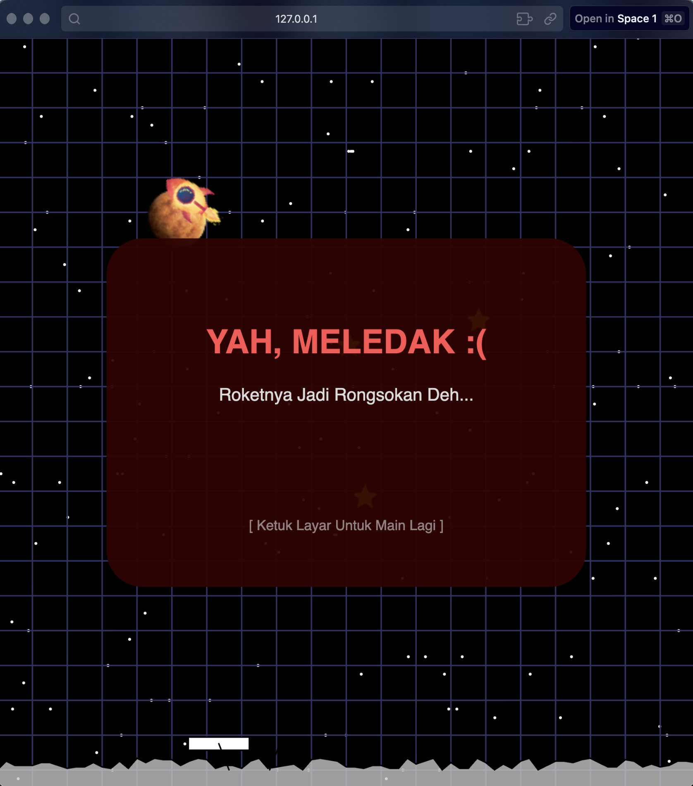

# 🚀 Lunar Mission: Web & Mobile Edition

> **"Experience the thrill of space physics right in your browser."**

**Lunar Mission** is a modern reimagining of the classic arcade game *Lunar Lander*. Built originally in Processing (Java) and ported to **p5.js (Web)**, this project demonstrates the implementation of Computer Graphics concepts such as 2D Geometric Transformations, Procedural Generation, and Physics Simulation.

🎮 **[PLAY THE DEMO HERE](https://[USERNAME].github.io/lunar-mission-p5js/)** 🎮

---

## ✨ Key Features

### 📱 1. Hybrid Control System (Cross-Platform)
The game automatically detects your device and adjusts the control scheme:
* **Desktop:** Uses Keyboard (`Arrow Keys`) or Mouse interaction.
* **Mobile:** Renders **Virtual On-Screen Buttons** (Gas & Steering) with Multi-touch support.

### 📐 2. Responsive & Adaptive UI
The interface scales mathematically (`min(w, h)`) to fit any screen aspect ratio, ensuring the game looks perfect on both Landscape and Portrait modes without UI clipping.

### 🎨 3. Computer Graphics Implementation
* **Transformation Matrices:** Utilizes `translate()`, `rotate()`, and `push/pop` for realistic rocket physics.
* **Procedural Terrain:** The moon surface is generated randomly using polygon filling algorithms, ensuring a unique level every time.
* **Interpolation Animation:** Smooth UI transitions using Linear Interpolation (`lerp`).

---

## 🕹️ How To Play

**Objective:** Land the rocket safely on the **Green Pad**.
* Do not land too fast (Watch your speed!).
* Do not run out of fuel.
* Avoid asteroids and planets.
* Collect stars for a higher rating (⭐⭐⭐⭐⭐).

| Action | Desktop (Keyboard) | Mobile (Touch) |
| :--- | :--- | :--- |
| **Thrust (Gas)** | `UP Arrow` / `Mouse Click` | 🔴 **Red Button** |
| **Rotate Left** | `LEFT Arrow` | ◀️ **Left Button** |
| **Rotate Right** | `RIGHT Arrow` | ▶️ **Right Button** |
| **Menu Select** | Keys `1`, `2`, `3` | Tap on Screen |

---

📸 Screenshots

## Menu & Gameplay
<table>
<tr>
  <th>Menu Interface</th>
  <th>Gameplay Action</th>
</tr>
<tr>
  <td></td>
  <td></td>
</tr>
</table>

## Mobile & Result
<table>
<tr>
  <th>Mobile Controls</th>
  <th>Success / Fail State</th>
</tr>
<tr>
  <td></td>
  <td></td>
</tr>
</table>

*(Note: Screenshots demonstrate the responsive UI adapting to different screens)*

---

## 🛠️ Technical Overview

This project was developed for the **Computer Graphics** course at **Politeknik Negeri Jakarta**.

* **Language:** JavaScript (ES6)
* **Framework:** [p5.js](https://p5js.org/)
* **Physics:** Custom Velocity & Gravity Logic
* **Original Code:** Processing (Java) - *Available in `src_legacy/` folder*

---

## 👥 Credits (Team 6)

* **Dimas Eka Maulana** (Developer & Logic)
* **Darwin Alesandro Kefaz** (Developer & Assets)
* **Nabilla Puti Jasmien** (Documentation & UI)

---

Developed with ❤️ using p5.js
